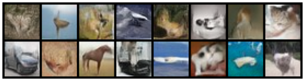
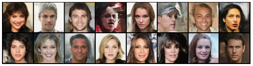
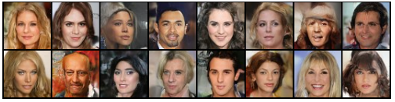

# NVAE from scratch

Pytorch implementation (using Distributed Data Parallel and Automatic Mixed Precision) of **Nouveau-VAE**:
[paper link](https://arxiv.org/abs/2007.03898)

The implementation uses [FFCV](https://github.com/libffcv/ffcv) for fast data loading and 
[WandB](https://wandb.ai/site) for logging.

### Note on the implementation and useful resources

The repository is based on the official github repo of [NVAE](https://github.com/NVlabs/NVAE), implementing all the main
features and details, while trying to keep the code well organized and clean.  

Further resources that have been useful in the implementation include: 

- Unofficial NVAE implementations by [mgp123](https://github.com/mgp123/nvae) 
and [GlassyWing](https://github.com/GlassyWing/nvae).
- The amazing Blog Post by [M.G. Portnoy](https://www.matiasgrynbergportnoy.com/posts/nvae/), which well explains the 
main architecture and some tricks.


## Install and Run

### Installation

```
# Dependencies Install 
conda env create --file environment.yml
conda activate nvae_from_scratch

# package install (after cloning)
pip install .
```

*Note: Check the `pytorch-cuda` version in `environment.yml` to ensure it is compatible with your cuda version.*

### Dataset Creation

You need to create the `.beton` files to correctly load your datasets. You can use the provided 
script `./data/make_ffcv.py`, that will take as input one or more image folders (train, validation, test) and output 
the corresponding `train.beton`, `validation.beton`, `test.beton` files in the provided output folder. 

Please refer to the official [ffcv docs](https://docs.ffcv.io/) for more information.

### Training

To train your own `NVAE` model, you need to launch the `train.py` script. The script is compatible with 
multi-gpu and multi-node setups using `torchrun` or `mpirun`. 

For example:  
On a multinode cluster I use `mpirun` (enables to run only from master node)
    
    mpirun -np world_size 
           -H ip_node_0:n_gpus,ip_node_1:n_gpus ... 
           -x MASTER_ADDR=ip_master 
           -x MASTER_PORT=1234
           -bind-to none -map-by slot -mca pml ob1 -mca btl ^openib
           python train.py --args

In a single node, multi-gpu, local environment I use `torchrun`

    torchrun --nproc_per_node=ngpus 
             --nnodes=1 
             --node_rank=0 
             --master_addr='localhost'
             --master_port=1234 
             train.py --args

For debugging on 1 GPU I simply run the script

    python train.py --args

Regarding the `--args`, these are:

- `--run_name xxx` represents the unique name of the training run, used to save checkpoints and logging.
- `--conf_file ./example.yaml` path to a `.yaml` configuration file, like the one in `./configuration_files/base_conf.yaml`, 
where you can find more information on the single parameters.
- `--data_path ./dataset/` path to a directory containing the `train.beton` and `validation.beton` files previously created.
- `--checkpoint_base_path ./checkpoints/` path to the base directory where checkpoints are saved.
- `--resume_from ./checkpoints/last.pt` path to a specific checkpoint file, in case of resuming training.
- `--logging` will attempt to log results using `wandb`. 
- `--wandb_id z3c4z5r3` unique id of a specific wandb run, useful when resuming.
    
## Evaluation Scripts

The `./scripts/` directory contains three scripts:
1. `update_bn_stats.py`: it is beneficial to readjust the batch norm statistics of a trained model. This script does it,
for a specific sampling temperature. The updated model is saved as a copy on the same checkpoint file passed as input. 
This is the first script to launch after training. 
2. `evaluate.py`: computes L2 reconstruction error, FID and IS scores for generation ability measures.
3. `sample_random_images.py`: samples and save some images for qualitative evaluations.

_Note: check the single scripts for a description of the arguments to be passed._

## Results

Some pretrained models and their configuration files can be downloaded from: 
[https://huggingface.co/SerezD/NVAE-from-scratch](https://huggingface.co/SerezD/NVAE-from-scratch)

### CIFAR 10 (Unconditioned)

The trained models have 3 scales, each one with 8 groups (24 latents in total). 
One version has additional normalizing flows cells.

| Run Name    | Temperature | L2 (1e-5) | FID   | IS           | # (trainable) params |  
|-------------|-------------|-----------|-------|--------------|---------------------:|
| NVAE 8x3    | 0.6         | 10.097    | 19.73 | 6.00 +- 0.24 |            705.678 M |
| NVAE 8x3    | 0.8         | 03.918    | 23.63 | 6.36 +- 0.16 |            705.678 M |
| NVAE 8x3    | 1.0         | 01.243    | 32.50 | 5.77 +- 0.19 |            705.678 M |
| NVAE 8x3 NF | 0.6         | 07.814    | 20.66 | 6.94 +- 0.09 |            707.403 M |
| NVAE 8x3 NF | 0.8         | 03.223    | 24.73 | 6.53 +- 0.22 |            707.403 M |
| NVAE 8x3 NF | 1.0         | 00.997    | 33.28 | 5.80 +- 0.13 |            707.403 M |

Random Samples from NVAE 8x3 NF (temp 0.6):  


### CELEBA 64x64

The trained model has 3 scales, each one with 8 groups (24 latents in total). 

| Run Name    | Temperature | L2 (1e-5) | FID   | IS           | # (trainable) params |  
|-------------|-------------|-----------|-------|--------------|---------------------:|
| NVAE 8x3    | 0.6         | 02.751    | 14.86 | 2.20 +- 0.03 |            705.678 M |
| NVAE 8x3    | 0.8         | 01.996    | 12.82 | 2.18 +- 0.06 |            705.678 M |
| NVAE 8x3    | 1.0         | 01.746    | 15.10 | 2.16 +- 0.05 |            705.678 M |

Random Samples (temp 0.6):  


Random Samples (temp 0.8):  


Random Samples (temp 1.0):  

